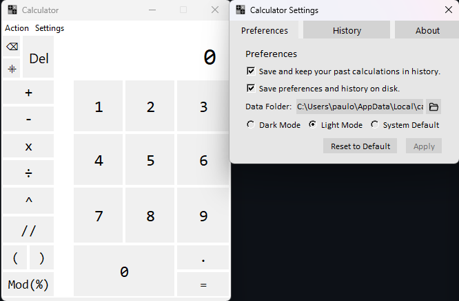

# Calculator-Tk 
   - Easy to use tkinter calculator with built-in history and settings.

# License
   - Calculator-Tk is licensed through <a href="https://mit-license.org/">MIT License</a>.

 

# Announcements
   ### Version v1.10
   - Added basic operations and numbers.  
     - Operations: Plus(+), Minus(-), Multiply(x), Divide(÷), Modulus(%), FloorDivision(//), Power(^)
     - Parenthesis: Open "(", Close ")"
     - Basic Options: Equal(=), Dot(.)
     - Extra Options: Remove Decimal  
   - Added a tab for actions.
   - Added a tab for settings.  
     - Contains 3 tabs: Preferences, History, About
     - Preferences Window:  
       - Checkbox for enabling history tracking (Default: On)
       - Checkbox for saving your settings on your hard drive (Default: On)
       - Entry to specify where your settings are on the hard drive (Default: <your AppData/Local path> + calculator-tk)
       - Options for using Dark Mode, Light Mode, System Default (Default: System Default)
       - Button for resetting settings to default
       - Button for applying your settings  
     - History Window:  
       - Each list contains:  
         - Remove Button (-)
         - Operation = Result (Text)
         - Timestamp  
       - Pages:  
         - Button for going back by one page
         - Entry for the page count (Can be edited)
         - Button for going next by one page  
       - Button for clearing the list
       - Button for removing an item from the list
       - Button for opening an operation to your calculator (Must be one item selected from the list)
       - Button for applying your settings  
     - About Window:  
        - Displays the following:  
            Calculator - Version v1.0.0 
            Coded and published by SrpCD.  
            Python Version: (Your Python Version) x(Archiecture) 
            Tkinter Version: (Your Tkinter Version)
 

# Install
   1. Make sure you have [Python 3.11](https://www.python.org/downloads/release/python-3111/) installed.
   2. Requires Windows 7-11
   3. Requires [Git](https://git-scm.com/download/win)
   4. Open the build batch file.
   5. Press Y to build the application.
   6. After it's finished, go to the dist folder, and open the executable file.

 

   
   
   
   
  
  

